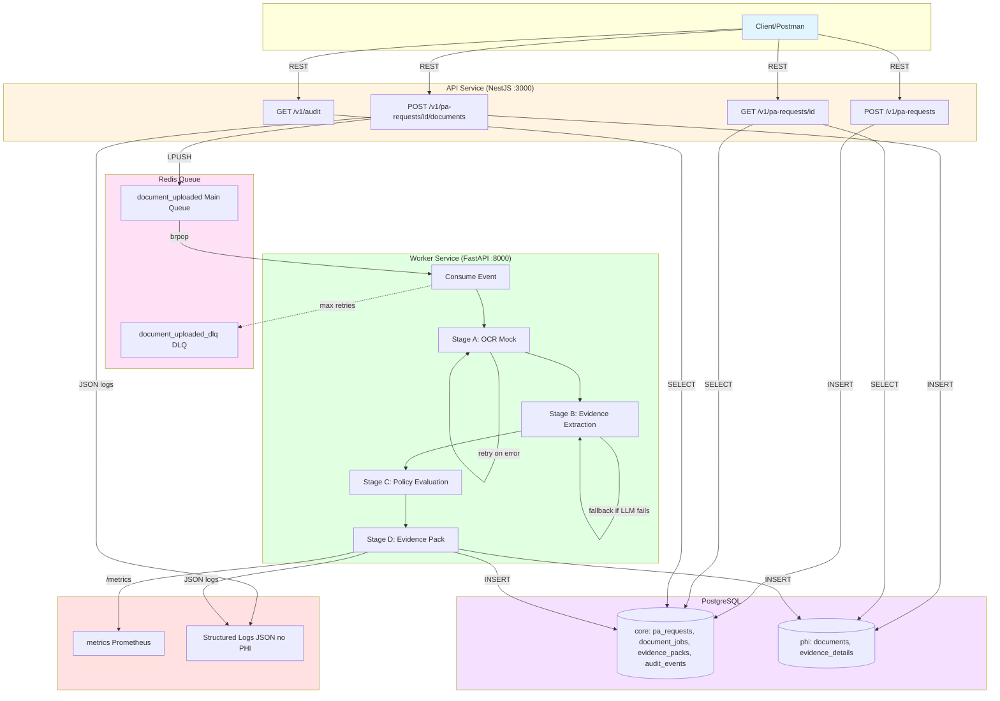

# PA Evidence Pipeline – Final Summary

## What this does
- Accepts Prior Authorization requests and uploaded synthetic notes.
- Runs an async workflow (OCR mock → evidence extraction → policy evaluation) and produces an auditable Evidence Pack with sources.
- Enforces idempotency, retries with backoff, DLQ, rate limiting, and concurrency control.
- Keeps PHI separated in Postgres schemas (`core` vs `phi`); no PHI in logs.

## Architecture
- API: NestJS/TypeScript (REST, idempotent uploads, audit retrieval).
- Worker: FastAPI/Python (queue consumer, pipeline stages, metrics).
- Infra: Postgres, Redis list queue + DLQ, docker-compose.
- Observability: JSON logs, Prometheus metrics (`/metrics`), health (`/health`), audit log in DB.

## Workflow
1) POST `/v1/pa-requests` → `request_id`.
2) POST `/v1/pa-requests/{id}/documents` with `Idempotency-Key` → enqueues `DocumentUploaded`.
3) Worker consumes: OCR mock → heuristic extraction with citations → TKA policy:
   - Requires: diagnosis osteoarthritis, imaging evidence, conservative therapy (PT required; NSAIDs alone insufficient), functional limitation.
   - Decision: APPROVE if all present; else NEEDS_MORE_INFO with missing list.
4) Persist evidence pack + metadata + audit; status returned via GET.

## Running locally
```
docker compose up --build
```
Services: API 3000, Worker 8000, Postgres 5432, Redis 6379.  
Env defaults: `API_KEY=dev-api-key`, `QUEUE_NAME=document_uploaded`, `DLQ_NAME=document_uploaded_dlq`, `EXTRACTION_MODE=heuristic` (set to `hybrid` for LLM fallback), `MAX_ATTEMPTS=3`, `MAX_CONCURRENCY=5`, `MAX_RATE_PER_SEC=5`, `BACKOFF_BASE_SECONDS=1.5`.

## Quick E2E (happy path)
```
REQ=$(curl -s -X POST http://localhost:3000/v1/pa-requests -H "x-api-key: dev-api-key" | jq -r .request_id)
curl -s -X POST http://localhost:3000/v1/pa-requests/$REQ/documents \
  -H "x-api-key: dev-api-key" -H "Idempotency-Key: demo-key-1" \
  -H "Content-Type: application/json" \
  -d '{ "text": "Patient: John Doe\nDx: Knee pain, suspected osteoarthritis.\nImaging: X-ray shows joint space narrowing and osteophytes.\nTherapy: Trial of NSAIDs for 3 weeks. No documented physical therapy.\nFunction: Difficulty climbing stairs; cannot walk > 1 block; ADLs impacted.\nPlan: Requesting total knee arthroplasty." }'
sleep 1
curl -s http://localhost:3000/v1/pa-requests/$REQ -H "x-api-key: dev-api-key"
curl -s "http://localhost:3000/v1/audit?request_id=$REQ" -H "x-api-key: dev-api-key"
```
Current policy requires PT; NSAIDs alone are insufficient, so the sample note returns NEEDS_MORE_INFO (missing PT). To relax, allow NSAIDs; to harden, require both PT and NSAIDs.

## DLQ test
```
REQ=$(curl -s -X POST http://localhost:3000/v1/pa-requests -H "x-api-key: dev-api-key" | jq -r .request_id)
curl -s -X POST http://localhost:3000/v1/pa-requests/$REQ/documents \
  -H "x-api-key: dev-api-key" -H "Idempotency-Key: dlq-1" \
  -H "Content-Type: application/json" \
  -d '{ "text": "FAIL_OCR" }'
sleep 8
docker compose exec redis redis-cli LRANGE document_uploaded_dlq 0 -1
```

## Testing
- Unit tests (worker logic for idempotency skip and retry→DLQ):  
  `pip install -r worker/requirements.txt -r tests/requirements.txt && PYTHONPATH=. pytest tests/test_worker_logic.py`

## Notes on compliance/reliability
- PHI separation via schemas; no document text in logs or audit.
- Idempotency enforced by `(request_id, Idempotency-Key)` with `SELECT FOR UPDATE` to prevent race conditions.
- Retries with exponential backoff (default 3 attempts, base 1.5s), DLQ on exhaustion, semaphore-based concurrency (default 5), rate limiter simulates downstream limits (default 5 req/sec).
- Audit log captures actor/action/metadata/timestamp; API key treated as actor.
- Extraction mode: heuristic (default) or hybrid (LLM with fallback to heuristics).

## Design choices and next steps
- Queue: Redis list for simplicity and local dev. Limitation: no visibility timeout/ack; next step would be SQS/Redis streams/Kafka with leases and explicit ack to strengthen at-least-once semantics.
- Extraction: Heuristic, deterministic parsing for predictability (default); optional hybrid mode (`EXTRACTION_MODE=hybrid`) with LLM-style extractor + fallback to heuristics. Next: plug real LLM with strict JSON schema validation, confidence thresholds, richer citations.
- Policy: Simplified TKA; currently requires PT (physical therapy); NSAIDs alone are insufficient. Next: make policy configurable per payer (PT-only vs PT-or-NSAIDs).
- Idempotency: Enforced at API via `(request_id, Idempotency-Key)`. Next: add worker-side idempotent state machine/outbox for exactly-once effects.
- Observability: JSON logs + Prometheus metrics. Next: add tracing (OpenTelemetry), dashboards/alerts (DLQ growth, latency SLO), stage-level timing metrics.
- Security: API key only. Next: add JWT/service auth, secret management, TLS, DB roles per schema, and encryption at rest.

## Follow-up call prep
- Failure modes: worker retries/backoff, DLQ on exhaustion; idempotent writes handle replays; at-least-once delivery acknowledged.
- Exactly-once vs at-least-once: current design is at-least-once with idempotency; exactly-once would need stronger queue acks/visibility and/or worker state machine/outbox.
- Evolution: real OCR vendor integration with timeouts/retries; add FHIR mapping layer (Condition/ServiceRequest/Observation); add per-tenant scoping and per-payer policy config.
- Security posture: PHI-safe logging, core/phi schemas; next steps—TLS, secret management, per-schema DB roles, RBAC/JWT/service auth, encryption at rest, alerts/monitoring.

## Follow-up call answers (quick notes)
- Worker crash mid-stage: jobs reprocessed via at-least-once + idempotent writes; retries with backoff; DLQ on exhaustion.
- Exactly-once vs at-least-once: current is at-least-once; to get closer to exactly-once, use a queue with visibility/acks and a worker state machine/outbox for idempotent effects.
- Evolution: OCR vendor client with timeout/retries/circuit breaker and guardrails; FHIR mapping from evidence to Condition/ServiceRequest/Observation with validation; multi-tenant via tenant_id scoping, per-tenant policies, secrets/keys, optional per-tenant queues.
- Security posture: enforce TLS, secret management, per-schema DB roles/least privilege, at-rest encryption (KMS), PHI-safe logging/redaction, alerts/monitoring/audit retention.


## Architecture-mermaid-diagram
- API (NestJS/TypeScript) handles PA requests, document uploads (Idempotency-Key), status retrieval, and audit retrieval.
- Worker (FastAPI/Python) consumes document events from Redis, runs OCR mock → extraction → policy evaluation → evidence pack persistence, with retries/backoff/DLQ and rate limiting.
- PostgreSQL with schemas: `core` (metadata, audit, decisions) and `phi` (documents, evidence details).
- Redis queues: `document_uploaded` main queue; `document_uploaded_dlq` dead-letter queue.

